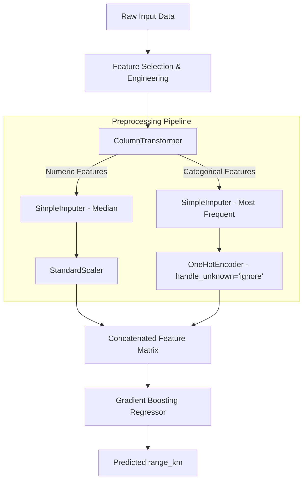

# Electric Vehicle (EV) Range Prediction Model

## Executive Summary

This project develops a **reproducible, leak-free Machine Learning model** to predict the driving range (`range_km`) of Electric Vehicles based on technical specifications. Starting from a raw specification dataset of 478 EV models, we conducted a rigorous data audit, engineered domain-specific features, built a leak-proof preprocessing pipeline, and systematically benchmarked multiple regression algorithms.

The final selected model—a tuned **Gradient Boosting Regressor**—achieves outstanding performance on unseen test data:

- **$R^2$ Score**: `0.9813` (explaining **98.13%** of variance in vehicle range)
- **Mean Absolute Error (MAE)**: `10.82 km`
- **Root Mean Squared Error (RMSE)**: `14.08 km`

The entire end-to-end preprocessing and modeling workflow is serialized into a single Joblib artifact (`model/ev_range_pipeline.joblib`), ensuring seamless deployment and zero-leakage inference on new vehicle inputs.

---

## 1. Problem Statement & Data Leakage Control

### 1.1 Objective
Build a predictive model that accepts raw EV physical and mechanical specifications (e.g., battery size, dimensions, power, seating) and returns an accurate estimate of vehicle range in kilometers (`range_km`).

### 1.2 Target Leakage Prevention Policy
A critical requirement of this project was enforcing strict data hygiene to avoid data leakage:
- **`efficiency_wh_per_km` (EXCLUDED)**: Energy efficiency is algebraically linked to range ($\text{range\_km} \approx \frac{\text{battery\_capacity\_kWh}}{\text{efficiency\_wh\_per\_km}} \times 1000$). Including efficiency as an input feature would allow the model to trivially calculate the target rather than learning underlying physical relationships. Thus, `efficiency_wh_per_km` was strictly excluded from feature matrix $X$.
- **Identifier & Metadata Exclusion**: Non-predictive metadata (`source_url`, `brand`, `model`) were dropped from $X$ to ensure the model generalizes to new, unseen vehicle models.
- **Zero / Near-Zero Variance Features**:
  - `battery_type`: Constant value across all entries (`Lithium-ion`) $\rightarrow$ Dropped.
  - `fast_charge_port`: 476 out of 478 entries are `CCS` $\rightarrow$ Dropped due to lack of variance.

---

## 2. Data Audit & Preprocessing Workflow

### 2.1 Raw Dataset Overview
- **Total Samples**: 478 rows
- **Total Initial Columns**: 22 attributes
- **Target Variable**: `range_km` (Continuous numeric, mean: 393.18 km, range: 135 km to 685 km)

### 2.2 Missing Value Profiling & Handling Strategy
| Feature Name | Missing Count | Missing % | Handling Strategy |
| :--- | :---: | :---: | :--- |
| `number_of_cells` | 202 | 42.3% | Kept raw column + created binary flag `cells_missing_flag`. Imputed via median inside pipeline. |
| `towing_capacity_kg` | 26 | 5.4% | Median imputation inside pipeline |
| `torque_nm` | 7 | 1.5% | Median imputation inside pipeline |
| `fast_charging_power_kw_dc` | 1 | 0.2% | Median imputation inside pipeline |
| `cargo_volume_l` | 1 | 0.2% | Cleaned string formats, then median imputed in pipeline |
| `model` | 1 | 0.2% | Filled with `"Unknown"` |

> **Crucial Design Decision**: Imputation and scaling are **not** performed before the train/test split. All imputers and transformers are fit strictly on the training fold within a Scikit-Learn `ColumnTransformer` to prevent test-set distribution leakage.

### 2.3 Domain Specific Data Cleaning
- **Banana Box Volume Standardization**: In `cargo_volume_l`, three entries were recorded in non-standard units (e.g., `"10 Banana Boxes"`, `"31 Banana Boxes"`, `"13 Banana Boxes"`). These were converted to liters using the standard automotive testing equivalence:
  $$\text{Volume (Liters)} = N_{\text{Banana Boxes}} \times 52\text{ Liters}$$

---

## 3. Feature Engineering

To provide deep physical context regarding vehicle aerodynamics, battery utility, and performance tuning, five domain-specific features were created:

$$\begin{aligned}
\text{footprint\_m2} &= \left(\frac{\text{length\_mm}}{1000}\right) \times \left(\frac{\text{width\_mm}}{1000}\right) && \text{(Vehicle ground footprint area)} \\[8pt]
\text{volume\_m3} &= \text{footprint\_m2} \times \left(\frac{\text{height\_mm}}{1000}\right) && \text{(Approximate vehicle spatial envelope)} \\[8pt]
\text{battery\_per\_seat} &= \frac{\text{battery\_capacity\_kWh}}{\text{seats}} && \text{(Energy allocation per passenger)} \\[8pt]
\text{torque\_per\_100kwh} &= \frac{\text{torque\_nm}}{\text{battery\_capacity\_kWh}} \times 100 && \text{(Drivetrain aggressiveness ratio)} \\[8pt]
\text{segment\_group} &= \text{Prefix of market segment (e.g., B, JB, JC)} && \text{(Broad market classification)}
\end{aligned}$$

---

## 4. Machine Learning Pipeline Architecture

### 4.1 Train/Test Split
- **Split Ratio**: 80% Training (382 samples), 20% Testing (96 samples)
- **Random Seed**: `42` (ensuring 100% reproducibility)

### 4.2 Pipeline Structure


---

## 5. Model Comparison & Hyperparameter Tuning

We benchmarked 6 model families using 5-Fold Cross-Validation on the training set:

### 5.1 Cross-Validation Benchmark Results
| Model | 5-Fold CV Mean RMSE (km) | CV RMSE Std (km) | Status |
| :--- | :---: | :---: | :--- |
| **Ridge Regression** | **19.57** | $\pm 3.00$ | Selected for tuning |
| **Gradient Boosting Regressor** | **22.53** | $\pm 2.52$ | Selected for tuning |
| Lasso Regression | 24.85 | $\pm 3.01$ | Baseline |
| XGBoost Regressor | 24.88 | $\pm 4.53$ | Baseline |
| Random Forest Regressor | 24.94 | $\pm 3.90$ | Baseline |
| Linear Regression (Ordinary) | 33.07 | $\pm 11.79$ | High variance |

### 5.2 Hyperparameter Tuning via GridSearchCV
- **Ridge Regression**:
  - Grid: `alpha ∈ [0.1, 1, 5, 10, 20, 50, 100]`
  - Best Parameter: `alpha = 1.0` $\rightarrow$ Best CV RMSE: `19.57 km`
- **Gradient Boosting Regressor**:
  - Grid: `n_estimators ∈ [100, 200, 300]`, `max_depth ∈ [2, 3, 4]`, `learning_rate ∈ [0.03, 0.05, 0.1]`
  - Best Parameters: `learning_rate = 0.1`, `max_depth = 3`, `n_estimators = 300` $\rightarrow$ Best CV RMSE: `21.11 km`

---

## 6. Final Evaluation on Held-Out Test Data

The final performance was evaluated on the **96 unseen vehicles** in the held-out test set:

| Evaluation Metric | Ridge (Tuned Baseline) | Gradient Boosting (Final Winner) | Improvement |
| :--- | :---: | :---: | :---: |
| **Mean Absolute Error (MAE)** | 13.96 km | **10.82 km** | **-22.5% Error** |
| **Root Mean Squared Error (RMSE)** | 17.61 km | **14.08 km** | **-20.0% Error** |
| **Coefficient of Determination ($R^2$)** | 0.9707 | **0.98126 (98.13%)** | **+1.06% Variance Explained** |

### Why Gradient Boosting Won
While Ridge performed strongly, Gradient Boosting captured non-linear interactions between battery size, vehicle weight, and frontal height without requiring manual interaction terms. Shallow tree depth (`max_depth = 3`) effectively regularized the model against overfitting the small dataset.

---

## 7. Feature Importance & Model Interpretability

Extracting tree-based feature importances from the final Gradient Boosting model reveals the dominant drivers of EV range:

| Top Feature | Importance Score | Domain Significance |
| :--- | :---: | :--- |
| `num__battery_per_seat` | **49.99%** | Energy capacity relative to passenger capacity |
| `num__battery_capacity_kWh` | **34.03%** | Gross battery pack energy |
| `num__height_mm` | **5.12%** | Vehicle aerodynamic height / frontal drag area |
| `num__fast_charging_power_kw_dc` | **3.48%** | Charging infrastructure / battery thermal management capacity |
| `num__torque_per_100kwh` | **1.28%** | Motor tuning efficiency |
| `cat__car_body_type_SUV` | **0.96%** | SUV body style penalty/benefit |
| `cat__car_body_type_Sedan` | **0.78%** | Sedan aerodynamic profile |

Together, `battery_per_seat` and `battery_capacity_kWh` account for **~84%** of the model's total predictive power.

---

## 8. Reproducibility & Model Deployment

### 8.1 Serialized Artifact
The entire pipeline (imputers, scalers, encoders, feature transforms, and the trained Gradient Boosting model) is saved to disk:
`model/ev_range_pipeline.joblib`

### 8.2 Loading & Running Predictions
```python
import joblib
import pandas as pd

# Load the fitted end-to-end pipeline
pipeline = joblib.load("model/ev_range_pipeline.joblib")

# Example raw input DataFrame (matching original specification format)
sample_input = pd.DataFrame([{
    'top_speed_kmh': 180,
    'battery_capacity_kWh': 77.4,
    'number_of_cells': 384,
    'torque_nm': 350,
    'acceleration_0_100_s': 7.3,
    'fast_charging_power_kw_dc': 233,
    'towing_capacity_kg': 1600,
    'seats': 5,
    'length_mm': 4635,
    'width_mm': 1890,
    'height_mm': 1605,
    'cargo_volume_l': '520',
    'drivetrain': 'RWD',
    'segment': 'JC - Medium',
    'car_body_type': 'SUV',
    'cells_missing_flag': 0,
    'footprint_m2': (4635 / 1000) * (1890 / 1000),
    'volume_m3': ((4635 / 1000) * (1890 / 1000)) * (1605 / 1000),
    'battery_per_seat': 77.4 / 5,
    'torque_per_100kwh': (350 / 77.4) * 100,
    'segment_group': 'JC'
}])

# Predict EV range in kilometers
predicted_range = pipeline.predict(sample_input)[0]
print(f"Predicted EV Range: {predicted_range:.2f} km")
```

---

## 9. Model Limitations & Future Scope

1. **Static Spec Sheet vs. Real-World Driving**: The target variable represents official WLTP/EPA rated range. Real-world range varies based on ambient temperature, HVAC load, driving habits, and terrain.
2. **Missing Battery Cell Count**: `number_of_cells` was missing in 42.3% of vehicles. Although flagged and median-imputed, more complete cell-level metadata (chemistry, voltage) could refine predictions further.
3. **Cargo Volume Approximation**: Conversion of `"Banana Boxes"` to liters ($1\text{ box} = 52\text{ L}$) is a standard empirical proxy.
